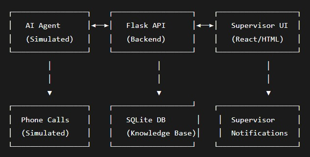

# Salon AI Supervisor - Human-in-the-Loop System

## Problem Statement

Frontdesk is building AI receptionists that can manage customer relationships end-to-end. The challenge is that current AI systems either hallucinate or fail when they don't know something. This project implements a human-in-the-loop system where AI agents can:

- Escalate unknown questions to human supervisors
- Learn from supervisor responses  
- Automatically update their knowledge base
- Follow up with customers after supervisor responses

## My Approach & Design Decisions

### Core Philosophy
Built a modular, scalable system that prioritizes clean architecture over premature optimization while meeting all functional requirements.

### Key Design Decisions

1. **Database Schema**
   - Used SQLite for simplicity with proper table relationships
   - Implemented request lifecycle (Pending → Resolved/Unresolved)
   - Added usage tracking for knowledge base optimization

2. **Modular Architecture**
   - Separated concerns: Agent logic, Knowledge Base, API, UI
   - Clean separation between business logic and presentation
   - Extensible design for future enhancements

3. **Knowledge Management**
   - Simple similarity matching (upgradable to embeddings)
   - Automatic learning from supervisor responses
   - Manual knowledge addition capability

4. **Scalability Considerations**
   - Database design supports 10→1000 requests/day
   - RESTful API for easy integration
   - Lightweight supervisor UI

## System Architecture


### Data Flow
1. Customer call simulated via API
2. AI checks knowledge base for answer
3. If unknown → Create help request + Notify supervisor
4. Supervisor responds via web UI
5. System follows up with customer + Updates knowledge base

## Folder Structure
```bash
frontdesk-ai-supervisor/
├── app/
│   ├── __init__.py                 # Flask app factory
│   ├── agent/
│   │   ├── __init__.py
│   │   ├── knowledge_base.py       # Knowledge base management
│   │   └── livekit_agent.py        # AI agent logic
│   ├── models/
│   │   ├── __init__.py
│   │   ├── database.py             # DB initialization
│   │   └── schemas.py              # SQLAlchemy models
│   ├── routes/
│   │   ├── __init__.py
│   │   ├── api.py                  # REST API endpoints
│   │   └── web.py                  # Web routes for UI
│   ├── templates/                  # HTML templates
│   │   ├── base.html               # Base template
│   │   ├── dashboard.html          # Main dashboard
│   │   ├── requests.html           # Request management
│   │   └── knowledge.html          # Knowledge base view
├── requirements.txt                # Python dependencies
└── run.py                          # Application entry point
```

## Setup and Installation

### Prerequisites
- Python 3.8+
- pip (Python package manager)

### Installation Steps

1. **Clone and Setup**
```bash
# Create virtual environment
python -m venv venv
source venv/bin/activate  
# On Windows: venv\Scripts\activate

# Install dependencies
pip install -r requirements.txt
```

2. **Run the Application**
```bash
python run.py
```

3. **Access the Application**

- Supervisor UI: `http://localhost:5000`
- API Base URL: `http://localhost:5000/api`

## Testing & Workflow

Refer to [TESTING.md](TESTING.md) for running the application, testing scenarios, and workflow details.

## Future Enhancements

### Phase 2 - Live Call Handling
- **Real-time Voice Integration**: Integrate LiveKit for actual voice call processing
- **Live Call Transfer**: Offer to put callers on hold and transfer to available supervisors
- **On-Hold Experience**: Implement wait music and position updates for callers

### Advanced AI Capabilities
- **Embedding-based Matching**: Replace simple similarity with sentence transformers for better understanding
- **Context Awareness**: Maintain conversation context across multiple turns
- **Intent Recognition**: Classify questions into categories for better routing
- **Confidence Scoring**: Add confidence thresholds for automatic vs. escalated responses

### Production Readiness
- **Authentication & Authorization**: Secure supervisor access with role-based permissions
- **Rate Limiting**: Protect APIs from abuse with proper rate limiting
- **Database Optimization**: Migrate to PostgreSQL with connection pooling
- **Containerization**: Dockerize the application for easy deployment
- **Monitoring & Logging**: Implement structured logging and performance monitoring

### Scalability Features
- **Supervisor Availability**: Manage supervisor shifts and availability status
- **Priority Routing**: Route urgent requests to available supervisors first
- **SLA Monitoring**: Track response times and service level agreements
- **Load Balancing**: Distribute requests across multiple supervisor instances

### Integration Capabilities
- **Multi-channel Support**: Extend beyond voice to SMS, web chat, and email
- **CRM Integration**: Sync customer data with existing CRM systems
- **Twilio/SMS Integration**: Real SMS notifications for supervisors
- **Webhook Support**: Allow external systems to subscribe to request events

### Advanced Analytics
- **Performance Dashboard**: Track AI accuracy, escalation rates, response times
- **Knowledge Gap Analysis**: Identify recurring unknown questions for proactive training
- **Supervisor Performance**: Monitor supervisor response quality and efficiency
- **Customer Satisfaction**: Integrate feedback mechanisms

## Technical Improvements
- **Request Timeout Handling**: Automatically resolve requests if supervisor doesn't respond
- **Database Migrations**: Implement proper schema migration system
- **Testing Suite**: Add comprehensive unit, integration, and end-to-end tests
- **Error Handling**: Improve error recovery and user-facing error messages
- **Caching**: Implement Redis caching for frequently accessed knowledge

## Conclusion

This human-in-the-loop system provides a solid foundation for building intelligent AI receptionists that can gracefully handle unknown queries while continuously learning and improving. The modular architecture allows for incremental enhancements while maintaining system reliability.

The system successfully demonstrates:
- ✅ Intelligent escalation when AI lacks knowledge
- ✅ Seamless supervisor integration
- ✅ Automated knowledge base updates
- ✅ Customer follow-up mechanisms
- ✅ Scalable database design
- ✅ Clean, maintainable code structure

This implementation meets the core requirements while providing a extensible platform for future enhancements in production environments.